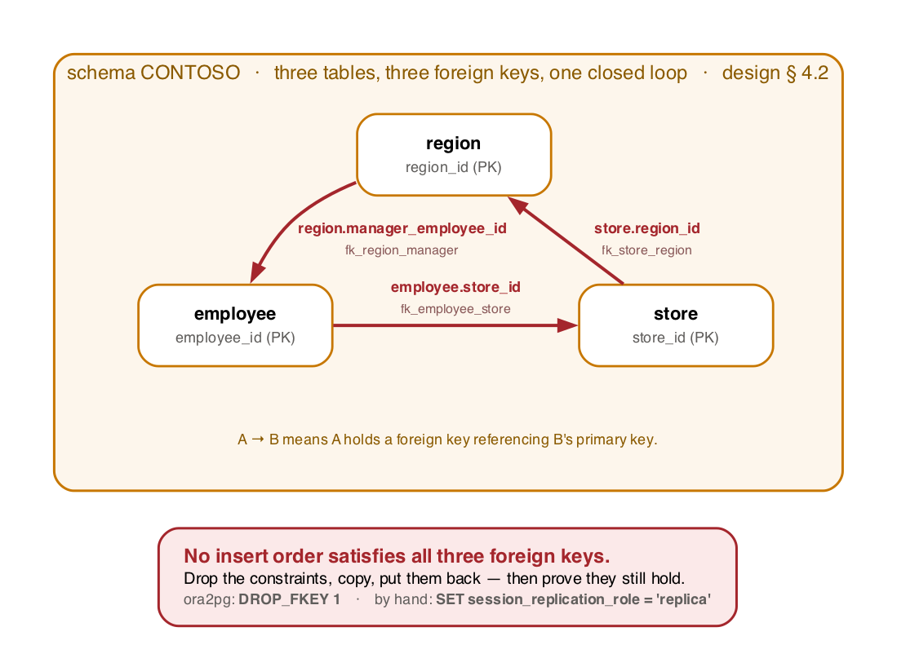

# 04 — Migrate the data

The conversion tool converts schema and code. **It does not copy a single table row.** This page is
the step that closes that gap.

- [Why this page exists](#why-this-page-exists)
- [1. Before you start](#1-before-you-start)
- [2. Choosing a tool](#2-choosing-a-tool)
- [3. Where to run it from](#3-where-to-run-it-from)
- [4. Configure ora2pg](#4-configure-ora2pg)
- [5. The constraint problem](#5-the-constraint-problem)
- [6. Run the copy](#6-run-the-copy)
- [7. The `LONG` column](#7-the-long-column)
- [8. Six more things that change the values](#8-six-more-things-that-change-the-values)
- [9. Sequences, and the bug you find in production](#9-sequences-and-the-bug-you-find-in-production)
- [10. Verify the copy](#10-verify-the-copy)
- [11. Troubleshooting](#11-troubleshooting)

---

## Why this page exists

> **"We ran the migration tool" and "we migrated" are different statements.**
>
> The AI-assisted conversion in `ms-ossdata.vscode-pgsql` produces tables, constraints, indexes,
> views, routines and triggers. After [03](03-run-ai-migration.md), `contoso_store` has a complete
> `contoso` schema and **zero rows**. That is scope, not a defect — but any end-to-end claim has to
> include this step, and this lab treats it as a first-class stage rather than an appendix.

Two consequences worth internalising before you start:

- **This step is not covered by the AI.** No model helps you here. It is ordinary, unglamorous data
  engineering, and on a real migration it is usually where the cutover window is spent.
- **It is where the type decisions made in [03](03-run-ai-migration.md) get tested.** A column the
  converter turned into the wrong type does not fail at `CREATE TABLE`. It fails, or worse silently
  succeeds, here.

---

## 1. Before you start

| # | Check | Why |
| --- | --- | --- |
| 1 | [03](03-run-ai-migration.md) finished and the schema is **applied** to `contoso_store` | You cannot copy into tables that do not exist |
| 2 | Review tasks are resolved, or you have decided which to defer | Rerunning the copy after a schema change means truncating and starting over |
| 3 | The source is stable | Anything still writing to `CONTOSO` gives you an inconsistent copy. Stop the scheduler jobs: `EXEC DBMS_SCHEDULER.DISABLE('job_nightly_replenishment');` and friends |
| 4 | You know your row counts | `./scripts/seed-oracle.sh` printed them; § 10 compares against them |
| 5 | Disk headroom on the target | `--scale 1` is roughly 4.5 M rows; the flexible server has 128 GiB, which is ample, but check if you raised the scale |

Record the source row counts **now**, before anything moves:

```bash
./scripts/connect.sh oracle-azure -c "
  SELECT table_name, num_rows FROM user_tables
   WHERE num_rows > 0 ORDER BY num_rows DESC;" > out/source-row-counts.txt
```

`num_rows` comes from optimiser statistics, so gather first if the seed did not:
`EXEC DBMS_STATS.GATHER_SCHEMA_STATS(USER, cascade => TRUE);`

---

## 2. Choosing a tool

Three real options. The lab defaults to the first (`DATA_MOVE_TOOL` in `.env`).

| Tool | Good for | Cost of using it here |
| --- | --- | --- |
| **`ora2pg`** *(lab default)* | Oracle-native. Understands `LONG`, `CLOB`, `XMLTYPE`, `TIMESTAMP WITH LOCAL TIME ZONE`. Reads Oracle metadata to drive the copy | Perl, `DBD::Oracle` and an Oracle client to install. That is the whole cost, and it is a real one |
| `pgloader` | Fast, simple, few dependencies | Its Oracle support is much weaker than its MySQL/SQLite support. `LONG` and `XMLTYPE` will fight you |
| Partner CDC (Striim, Qlik, Fivetran, Debezium+…) | Near-zero-downtime cutover, ongoing sync | Licensing, and a much larger setup. The right answer for a production migration and overkill for a lab |

**Do not use `ora2pg` to convert the schema.** It is entirely capable of it, and letting it do so
here would destroy the experiment: the whole point is to measure what the AI conversion produced,
and a rule-based tool quietly repairing the schema underneath it makes that measurement meaningless.
`tools/ora2pg.conf` therefore sets `TYPE COPY` — data only.

If you *do* want to compare the two converters, that is a genuinely interesting experiment. Run
ora2pg's schema conversion into a **third** database and diff the two outputs. Do not point it at
`contoso_store`.

---

## 3. Where to run it from

`ora2pg` needs to reach **both** databases at once. The PostgreSQL flexible server has no public
endpoint, so your laptop is not a candidate unless you tunnel both sides.

| Host | Reaches Oracle | Reaches PostgreSQL | Verdict |
| --- | --- | --- | --- |
| **Oracle VM** (`o2p-oracle-vm`) | Locally | Over the VNet | **Best.** No tunnel in the data path at all |
| Jumpbox (`o2p-jump`) | Over the VNet | Over the VNet | Fine. Windows, so the Perl setup is more work |
| Your laptop | Bastion tunnel | Bastion tunnel | Works, and every row crosses two tunnels. Do not do this at `--scale 1` |

Use the Oracle VM. Both endpoints are then on the VNet and nothing is proxied:

```bash
./scripts/connect.sh oracle-azure --shell
```

On the VM (Ubuntu 22.04):

```bash
sudo apt-get update
sudo apt-get install -y ora2pg libdbd-pg-perl postgresql-client
```

`DBD::Oracle` needs Oracle client libraries. The lab's VM already has the Oracle Free container, so
the simplest route is to run `ora2pg` **inside** it, where `ORACLE_HOME` is already set:

```bash
sudo docker exec -it o2p-oracle bash -lc 'ora2pg --version'
```

Whichever host you choose, confirm both directions before you start a long copy:

```bash
sqlplus -S -L "$CONTOSO_SCHEMA"/"$CONTOSO_PASSWORD"@//localhost:1521/FREEPDB1 <<< 'SELECT 1 FROM dual;'
psql "host=$PGHOST dbname=$PGDATABASE user=$PGUSER sslmode=require" -c 'SELECT 1;'
```

---

## 4. Configure ora2pg

`tools/ora2pg.conf` is in this repository and every non-default setting in it is commented with the
reason. Two things in it are deliberately not filled in:

| What | Value in the file | Why |
| --- | --- | --- |
| `PG_DSN` host | `o2p-pg-**CHANGEME**.postgres.database.azure.com` | Your server name contains a subscription-derived hash. It is not knowable in advance and must not be committed |
| `ORACLE_PWD`, `PG_PWD` | **empty** | This is a public repository. No committed file contains a password |

`ora2pg` does not expand environment variables in its configuration file, so the passwords have to
be substituted. Do it into a `0600` copy in a private temp directory that is deleted on exit —
including on failure. This is the same shape `scripts/deploy.sh` uses for ARM parameters, and for
the same reason: nothing sensitive should ever be visible to `ps`.

```bash
set -a; . ./.env; set +a

WORK="$(mktemp -d)"; chmod 700 "$WORK"
trap 'rm -rf "$WORK"' EXIT INT TERM        # deleted even if ora2pg dies

CONF="$WORK/ora2pg.conf"
sed -e "s|o2p-pg-CHANGEME\.postgres\.database\.azure\.com|${PGHOST}|" \
    "${ORA2PG_CONF:-./tools/ora2pg.conf}" > "$CONF"
chmod 600 "$CONF"

# The two passwords, appended rather than templated: later directives win in
# ora2pg's config parser, so this overrides the empty ones above.
{ printf 'ORACLE_PWD\t%s\n' "$CONTOSO_PASSWORD"
  printf 'PG_PWD\t%s\n'     "$PGPASSWORD"; } >> "$CONF"

ora2pg -c "$CONF"
```

If you are running through a tunnel rather than on the VM, also point `ORACLE_DSN` at the local end
of the forward. The file ships with `host=127.0.0.1;port=1521`, which is correct for the local
container and for a tunnel on the default port; `scripts/connect.sh` prints the port it actually
chose.

`out/` is gitignored, and nothing above writes a password into it. If you are tempted to edit
`tools/ora2pg.conf` in place instead, do not — that file is tracked.

The settings worth knowing before you run, all of them commented in place:

| Directive | Value | Why |
| --- | --- | --- |
| `TYPE` | `COPY` | Data only, streamed in one process. See § 2 |
| `SCHEMA` / `PG_SCHEMA` | `CONTOSO` → `contoso` | Oracle folds to upper, PostgreSQL to lower |
| `EXCLUDE` | `MLOG$_.* MV_.* STG_GEN_.* .*_NTAB` | MV logs, MV containers, empty generated staging tables, nested-table storage. Each is a decision, not a default |
| `DATA_TYPE` | includes `LONG:text` and `TIMESTAMP WITH LOCAL TIME ZONE:timestamptz` | Tells ora2pg the `LONG` is character data, not a locator |
| `LONGREADLEN` | `8388608` (8 MB) | § 7 |
| `LONGTRUNCOK` | `0` | § 7. **Do not change this** |
| `NULL_EQUAL_EMPTY` | `0` | § 8. Setting it to `1` invents a distinction the source never made |
| `DATA_LIMIT` / `FETCH_SIZE` | `10000` / `5000` | Rows per `COPY` batch, rows per Oracle fetch |
| `JOBS` / `ORACLE_COPIES` / `PARALLEL_TABLES` | `4` / `4` / `2` | Fits a 4-vCPU VM on both ends |
| `DROP_FKEY` | `1` | § 5 — the foreign keys are circular |
| `DISABLE_TRIGGERS` / `DISABLE_SEQUENCE` | `1` / `1` | § 5 and § 9 |

Two things the config does **not** do, which you have to handle yourself:

- **It does not truncate first.** There is no `TRUNCATE_TABLE` directive set, so a re-run after a
  partial copy *adds* rows rather than replacing them. Truncate by hand before every re-run (§ 11).
- **It does not stop on the first error.** `LOG_ON_ERROR 1` writes rejected rows aside and keeps
  going, which is the right default for a long copy but means the exit code alone will not tell you
  the copy was clean. Read `out/ora2pg/` afterwards, every time.

---

## 5. The constraint problem

`CONTOSO`'s foreign keys are **circular** on purpose:



<sub>Source: [`images/fk-cycle.dot`](images/fk-cycle.dot). Regenerate with `./docs/images/render.sh` — edit the `.dot`, never the `.png`.</sub>

There is no ordering of tables that satisfies every foreign key on insert. That circularity is
deliberate — naive converters emit DDL in dependency order and fall over on it — and it means the
copy cannot simply insert parents before children.

The answer is the standard one: **drop the constraints, copy, put them back, and then prove they
still hold.** `tools/ora2pg.conf` sets `DROP_FKEY`, `DISABLE_TRIGGERS` and `DISABLE_SEQUENCE` for
exactly this.

Indexes are a separate decision, and the config leaves them alone. Loading 4.5 M rows into a table
with eight indexes means maintaining eight B-trees per row, so dropping and rebuilding them once is
dramatically faster — but rebuilding them is then *your* job, and a forgotten index is a silent
performance regression that [05](05-validate.md) section 5 will make you chase. If you want that
speed-up, drop them deliberately and script the rebuild before you start:

```sql
-- capture the definitions FIRST; you cannot recover them afterwards
SELECT indexdef || ';' FROM pg_indexes
 WHERE schemaname = 'contoso' AND indexname NOT IN (
   SELECT conname FROM pg_constraint WHERE connamespace = 'contoso'::regnamespace);
```

**Triggers must be disabled too**, and for a subtler reason: the converted triggers *work*. The
`trg_bi_*` surrogate-key triggers will happily overwrite the primary keys you are copying, and the
audit triggers will write a row into `audit_log` for every row you insert — turning a 4.5 M row copy
into a 9 M row copy with wrong keys. `ora2pg` handles this by setting `session_replication_role`,
which suppresses user triggers for the session.

If you drive the copy yourself instead of using ora2pg, that is the mechanism:

```sql
SET session_replication_role = 'replica';   -- triggers and FK checks off
-- ... COPY ...
SET session_replication_role = 'origin';    -- back on
```

---

## 6. Run the copy

```bash
ora2pg -c "$CONF"        # $CONF is the 0600 temp copy from section 4
```

Timings, measured on the lab's `Standard_D4s_v5` with the data copy running on the Oracle VM:

| `--scale` | Rows | Typical |
| ---: | ---: | ---: |
| `0.01` | ~50 K | 1–3 min |
| `0.1` | ~450 K | 5–12 min |
| `1` | ~4.5 M | 30–90 min |
| `2` | ~9 M | 70–180 min |

The `LONG` column is a meaningful part of that spread. So is whether you ran from the VM or from
your laptop through two tunnels — the second is several times slower and is the most common reason
a copy "hangs".

Watch it from the target side:

```sql
-- ./scripts/connect.sh postgres
SELECT relname, n_live_tup FROM pg_stat_user_tables
 WHERE schemaname = 'contoso' AND n_live_tup > 0
 ORDER BY n_live_tup DESC LIMIT 20;
```

### Then put the constraints back

```sql
-- indexes and constraints, then VALIDATE
ANALYZE;
```

Re-create the foreign keys the converted schema declared, then confirm every one of them is
actually enforced — a constraint created `NOT VALID` and never validated is a constraint that is
not doing anything:

```sql
SELECT conrelid::regclass AS table_name, conname, convalidated
  FROM pg_constraint
 WHERE connamespace = 'contoso'::regnamespace
   AND contype = 'f'
   AND NOT convalidated;
```

Must return no rows. This is the direct counterpart of the Oracle-side assertion in
`src/oracle/99-verify-objects.sql` that every foreign key is `ENABLED` and `VALIDATED`.

---

## 7. The `LONG` column

`store.legacy_migration_notes` is Oracle `LONG`. There is exactly one such column in the schema and
it is there on purpose — this is hard case **H-33** — because `LONG` is awkward for every
extraction tool ever written, and a lab where the data step is trivial teaches nothing about the
data step.

What makes it awkward:

- A table may have at most one `LONG` column, and you cannot select two `LONG`s in one query.
- `LONG` cannot appear in a `WHERE` clause, in a `GROUP BY`, in a function call, or in most SQL
  contexts at all. Oracle has recommended converting `LONG` to `CLOB` since 8i.
- Client libraries read it through a fixed-size buffer. `DBD::Oracle` calls that `LongReadLen`.
  Anything past the buffer is either truncated or raises `ORA-24345`.
- It bites inside this repository too: `src/oracle/99-verify-objects.sql` cannot search
  `user_triggers.trigger_body` with `LIKE`, because that column is also a `LONG` and the attempt
  fails with `ORA-00932: expression is of data type LONG`. The comment there explains the
  workaround. If it inconveniences the lab's own verification file, it will inconvenience your
  migration.

### The two settings

```text
LONGREADLEN   8388608     # buffer, in bytes
LONGTRUNCOK   0           # 0 = raise on overflow, 1 = truncate silently
```

**`LONGTRUNCOK` stays `0`.** Silent truncation is the worst outcome available: the copy succeeds,
the row counts match perfectly, § 10 passes, and the content is wrong. Fail loudly and raise
`LONGREADLEN` instead.

Find the largest value you actually have before guessing — and note that you cannot do this with
`LENGTH(legacy_migration_notes)`, because that is a function call on a `LONG`. You need PL/SQL,
where the implicit `LONG` → `VARCHAR2` conversion works:

```sql
DECLARE
  v_max PLS_INTEGER := 0;
  v_len PLS_INTEGER;
BEGIN
  FOR r IN (SELECT legacy_migration_notes AS n FROM store) LOOP
    v_len := LENGTH(r.n);                    -- LONG -> VARCHAR2 happens here
    IF v_len > v_max THEN v_max := v_len; END IF;
  END LOOP;
  DBMS_OUTPUT.PUT_LINE('max LONG length: ' || v_max);
END;
/
```

That PL/SQL path caps at 32,767 bytes. If your data exceeds it, the honest answer is the one Oracle
has given for twenty years: **convert the column to `CLOB` on the source before migrating**.

```sql
-- on a copy of the source, not in the middle of a cutover
ALTER TABLE store MODIFY (legacy_migration_notes CLOB);
```

That is a legitimate migration step and worth recording as one: "we changed the source schema before
we could move it" is a real, common, and frequently unbudgeted part of a migration project.

On the target the column should be `text`. Check what the AI conversion actually chose:

```sql
SELECT data_type FROM information_schema.columns
 WHERE table_schema='contoso' AND table_name='store'
   AND column_name='legacy_migration_notes';
```

If it came back as `varchar(n)`, the copy will fail on the first long row — and that is a
[03](03-run-ai-migration.md) finding, not a data-movement one. Record it there.

---

## 8. Six more things that change the values

The copy is where the type decisions from [03](03-run-ai-migration.md) are cashed in. These six are
the ones that change *data*, not just types, and none of them raises an error.

| # | Case | What happens |
| --- | --- | --- |
| 1 | **H-38** empty string is `NULL` | Oracle returns `NULL` for a column containing `''`, so `''` arrives as `NULL`. That is faithful — and it is exactly why source and target then disagree on `WHERE col = ''`. Nothing to configure; know that it happened |
| 2 | **T-02** `DATE` carries a time | Oracle `DATE` is a timestamp to the second. If the conversion chose PostgreSQL `date`, the copy silently truncates every time component. Check the column types before copying, not after |
| 3 | **H-37** `TIMESTAMP WITH LOCAL TIME ZONE` | Oracle normalises to the *session* time zone on read. Your `NLS`/session zone during the copy therefore changes the values written. Pin it: `ALTER SESSION SET TIME_ZONE = 'UTC';` and make the target session UTC too |
| 4 | **T-04** `CHAR` blank padding | `country_code CHAR(2)` is blank-padded in Oracle. If the target column became `text`, the padding survives as real spaces and joins that used to match stop matching |
| 5 | **T-03** `VARCHAR2` byte versus character semantics | `VARCHAR2(30)` is 30 *bytes* by default. A multi-byte country name that fitted in Oracle can overflow a `varchar(30)` on the target. This one does error, at least |
| 6 | **H-34** `CLOB`/`BLOB` | Read through a LOB locator, not inline, or values larger than the read buffer truncate. `NO_LOB_LOCATOR 0` in the config keeps locators on |

Pin the session zone for the whole copy. This is a one-line change that prevents an entire class of
"the timestamps are all shifted by an hour" bug reports:

```sql
ALTER SESSION SET TIME_ZONE = 'UTC';
ALTER SESSION SET NLS_DATE_FORMAT = 'YYYY-MM-DD HH24:MI:SS';
```

---

## 9. Sequences, and the bug you find in production

`ora2pg` is configured with `DISABLE_SEQUENCE 1`, so the copy inserts the primary key values from
the source rather than letting sequences generate new ones. That is correct — you want the same
keys — but it leaves every sequence on the target sitting at its initial value.

The first `INSERT` your application makes then collides with an existing row. This is not subtle
once it happens, and it is completely invisible until it does.

Reset every sequence to its table's maximum:

```sql
-- ./scripts/connect.sh postgres
DO $$
DECLARE r RECORD; v_max bigint;
BEGIN
  FOR r IN
    SELECT s.relname AS seq, t.relname AS tbl, a.attname AS col
      FROM pg_class s
      JOIN pg_depend d   ON d.objid = s.oid AND d.classid = 'pg_class'::regclass
      JOIN pg_class t    ON t.oid = d.refobjid
      JOIN pg_attribute a ON a.attrelid = t.oid AND a.attnum = d.refobjsubid
      JOIN pg_namespace n ON n.oid = s.relnamespace
     WHERE s.relkind = 'S' AND n.nspname = 'contoso'
  LOOP
    EXECUTE format('SELECT COALESCE(MAX(%I),0) FROM contoso.%I', r.col, r.tbl) INTO v_max;
    PERFORM setval(format('contoso.%I', r.seq), GREATEST(v_max, 1));
    RAISE NOTICE 'contoso.% -> %', r.seq, GREATEST(v_max, 1);
  END LOOP;
END $$;
```

That covers sequences PostgreSQL knows are owned by a column. The lab has 24 hand-written and 50
generated sequences, and **`CONTOSO`'s standalone sequences are not owned by anything** — Oracle
sequences never are. Those are the ones that catch people. Compare the two lists:

```sql
SELECT sequencename FROM pg_sequences WHERE schemaname = 'contoso' ORDER BY 1;
```

against Oracle's `SELECT sequence_name, last_number FROM user_sequences ORDER BY 1;` and set the
remainder by hand. Two of the source sequences are deliberately `NOCACHE` and `CYCLE` (hard case
**H-22**); check what those became, because `CYCLE` and a `setval` interact in a way that will
surprise you.

---

## 10. Verify the copy

Three levels. Do all three; the first is necessary and nowhere near sufficient.

### Row counts

```bash
# Oracle
./scripts/connect.sh oracle-azure -c "
  EXEC DBMS_STATS.GATHER_SCHEMA_STATS(USER, cascade => TRUE);
  SELECT table_name, num_rows FROM user_tables WHERE num_rows > 0 ORDER BY table_name;"

# PostgreSQL
./scripts/connect.sh postgres -c "
  ANALYZE;
  SELECT relname, n_live_tup FROM pg_stat_user_tables
   WHERE schemaname='contoso' ORDER BY relname;"
```

Both are *estimates* from the statistics. For the tables you actually care about, count exactly.
And remember which tables should legitimately differ: global temporary tables should be empty on
both sides, `MLOG$_*` should not exist on the target at all, and the materialised view containers
are populated by `REFRESH`, not by the copy.

### Referential integrity

Every foreign key you re-created must be validated (§ 6). Any that is not is a constraint doing
nothing.

### Content, not counts

Row counts match trivially even when the data is wrong. Checksums do not:

```sql
-- Oracle
SELECT SUM(ORA_HASH(customer_id || '|' || email || '|' || TO_CHAR(created_ts,'YYYY-MM-DD HH24:MI:SS')))
  FROM customer;
```

```sql
-- PostgreSQL
SELECT SUM(hashtext(customer_id || '|' || email || '|' || to_char(created_ts,'YYYY-MM-DD HH24:MI:SS')))
  FROM contoso.customer;
```

The two hash functions differ, so the *numbers* will not match — compare **row-by-row on a sample**
instead, or compare aggregates that are hash-independent (`SUM`, `MIN`, `MAX`, `COUNT DISTINCT`) per
column. The systematic version of this is
[05 — Validate](05-validate.md), which runs the same business questions against both databases and
diffs the answers. That is the real test; this section is the smoke test.

---

## 11. Troubleshooting

| Symptom | Cause | Fix |
| --- | --- | --- |
| Target tables all empty after [03](03-run-ai-migration.md) | **Expected.** The tool converts schema and code only | You are on the right page |
| `ORA-24345: A Truncation ... error occurred` | A `LONG` or `CLOB` value exceeded `LONGREADLEN` | Raise `LONGREADLEN`. Do **not** set `LONGTRUNCOK 1` — § 7 |
| `ORA-00932: ... data type LONG` | You used `LONG` in a `WHERE`, a function, or a second `LONG` in one query | Read it in PL/SQL, or convert to `CLOB` on the source |
| Foreign key violations during the copy | Constraints were not dropped, and the FKs are circular | `DROP_FKEY 1`, or `SET session_replication_role = 'replica'` — § 5 |
| Row counts doubled after a re-run | The config does not truncate, so a re-run adds rows | Truncate the target tables yourself before every re-run — § 4 and § 8 |
| `audit_log` has far more rows than the source | Triggers were live during the copy | `DISABLE_TRIGGERS 1` — § 5 |
| Primary keys are not the source's | Surrogate-key triggers fired during the copy | Same cause. Truncate and redo; do not try to patch |
| First application insert hits a duplicate key | Sequences were never reset | § 9 |
| Timestamps all shifted | `TIMESTAMP WITH LOCAL TIME ZONE` read in a non-UTC session | Pin the session zone and redo those tables — § 8 |
| Values truncated with no error at all | `LONGTRUNCOK 1`, or a `DATE` mapped to `date` | § 7 and § 8. Silent truncation is the worst outcome; assume it until you have disproved it |
| Copy runs but is glacial | Running from your laptop through two Bastion tunnels | Run it on the Oracle VM — § 3 |
| `psql`/`ora2pg` cannot resolve the PostgreSQL FQDN | Private access only, by design | Run from inside the VNet |

A fuller symptom index for the whole lab is in [troubleshooting.md](troubleshooting.md).

---

`contoso_store` now has a converted schema **and** its data. Whether it answers the same questions
as the source is a different claim, and it is the next one.

**Next:** [05 — Validate](05-validate.md)
